# Extreme Tail Risk and Systemic Connectedness in European Banks

This repository contains a reproducible Python research pipeline for estimating extreme downside risk and systemic tail connectedness among major European banks.

The project combines GARCH filtering, Extreme Value Theory, conditional VaR and Expected Shortfall forecasting, VaR backtesting, ES scoring, empirical tail-dependence networks, empirical CoVaR-style systemic-risk measures, a static Student-t copula benchmark, and a Stress Activation Index for distinguishing persistent systemic connectedness from stress-activated systemic connectedness.

The current implementation uses free data sources as a prototype. Final empirical estimates may change after replacing Yahoo/FRED data with Refinitiv/LSEG data.

---

## Research intuition

The repository is written as an empirical research project rather than as a package. The goal is not to expose a polished API, but to make the full research workflow inspectable: data construction, diagnostics, model estimation, robustness checks, tables, and figures are all generated from explicit scripts.

The central empirical idea is that a bank can be systemically relevant in different ways. Some institutions are consistently connected to the rest of the system across normal and stressed periods. Others appear less central on average but become much more connected when markets enter stress. A static systemic-risk ranking can merge these two cases into one number and hide the distinction.

This repository therefore separates three concepts:

| Concept | Question answered | Example interpretation |
|---|---|---|
| Marginal tail risk | How extreme are this bank's own losses? | High ES means the bank has severe standalone downside risk |
| Persistent connectedness | How connected is this bank across regimes? | High persistent connectedness means the bank is consistently co-extreme with others |
| Stress activation | How much does connectedness increase in stress? | High stress activation means the bank becomes more systemically connected during stress |

---

## Repository status

This repository is a research prototype.

The current data pipeline is based on:

- Yahoo Finance equity prices
- Yahoo Finance market proxies
- FRED VIX data

The project is designed so that the data layer can later be replaced by Refinitiv/LSEG data while preserving the same modeling pipeline.

---

## Research question

The main question is:

> Do static tail-risk and dependence models obscure stress-state systemic connectedness among European banks?

The project studies whether marginal tail risk and systemic connectedness change across calm and stress regimes.

The motivation is that a single full-sample estimate can mix very different market states. Calm-period observations are numerically dominant in most financial samples, while crisis observations are fewer but economically more important. A static model can therefore produce an average dependence estimate that is statistically convenient but economically incomplete.

The project treats this as a measurement problem: it does not try to prove causal contagion, and it does not claim that one bank causes another bank's losses. Instead, it estimates whether extreme losses tend to occur together, whether that tendency changes in stress states, and whether banks can be classified by the way their tail connectedness behaves across regimes.

More specifically, it asks:

1. Are European bank losses heavy-tailed after filtering conditional volatility?
2. Do regime-specific EVT models change marginal tail-risk estimates?
3. Does empirical tail connectedness increase during stress regimes?
4. Which banks are persistently connected, and which become systemically connected mainly during stress?
5. Can a static Student-t copula benchmark reproduce the empirical joint-tail structure?

---

## Main contribution

The project introduces a Stress Activation Index for systemic tail connectedness.

Let

```math
C_i^{calm}(q)
```

be the average empirical tail connectedness of bank `i` in calm regimes at tail threshold `q`, and let

```math
C_i^{stress}(q)
```

be the corresponding average tail connectedness in stress regimes.

The Stress Activation Index is defined as

```math
SA_i(q)=C_i^{stress}(q)-C_i^{calm}(q).
```

Persistent Connectedness is defined as

```math
PC_i(q)=\frac{1}{2}\left(C_i^{stress}(q)+C_i^{calm}(q)\right).
```

Together, `PC_i(q)` and `SA_i(q)` classify banks into four systemic-tail types:

| Type | Persistent connectedness | Stress activation | Interpretation |
|---|---:|---:|---|
| Persistent core | High | Low | Systemically connected across regimes |
| Stress activator | Low | High | Becomes systemically connected mainly during stress |
| Stress-amplified core | High | High | Connected on average and further activated in stress |
| Peripheral | Low | Low | Lower persistent connectedness and lower activation |

This classification distinguishes banks that are consistently central in the tail-dependence network from banks whose systemic relevance emerges primarily during stress states.

The index is intentionally simple. Its purpose is to make the empirical distinction transparent rather than to introduce a highly parameterized model. A bank with high persistent connectedness is important because it is frequently tied to the system across regimes. A bank with high stress activation is important because its connectedness rises disproportionately when markets are already under pressure. These are different forms of systemic relevance.

The classification is descriptive. It should be read as a way to organize tail-dependence evidence, not as a structural model of contagion or default transmission.

---

## Main empirical findings from the prototype sample

The current free-data prototype produces the following findings.

### 1. Bank returns are heavy-tailed

Raw bank returns display strong excess kurtosis and large downside extremes. This motivates the use of volatility filtering and EVT-based tail modeling.

The practical implication is that normal-based risk estimates are not well suited to this setting. Large losses occur more often than a Gaussian model would suggest, and the most relevant observations for systemic-risk analysis are precisely the observations in the far left tail of returns.

### 2. GJR-GARCH filtering is appropriate

A GJR-GARCH(1,1) model with Student-t innovations is fitted to each bank return series.

The fitted models show:

- positive leverage terms across banks
- high volatility persistence
- Student-t degrees of freedom around 5 to 7
- standardized residuals that remain heavy-tailed, supporting EVT modeling

The role of GARCH filtering is to avoid treating volatility clustering as if it were the tail distribution itself. Bank returns become more volatile in crises, and raw extremes partly reflect time-varying volatility. Filtering returns produces standardized residuals, which are closer to the shock distribution. EVT is then applied to these standardized residual losses.

### 3. EVT residual tail estimates are economically meaningful

EVT is applied to standardized residual losses rather than raw returns. The main threshold is the 95% empirical quantile, with 90% and 97.5% thresholds used for robustness.

The 95% threshold balances bias and variance:

- 90% threshold: more exceedances, but less tail-specific
- 95% threshold: baseline choice
- 97.5% threshold: fewer exceedances, more estimation uncertainty

The threshold choice is important because EVT is only appropriate sufficiently far in the tail, but going too far into the tail leaves too few exceedances for stable estimation. The baseline threshold is therefore treated as a modeling choice supported by diagnostics rather than as a mechanical default.

### 4. Regime-specific EVT reallocates risk toward stress periods

Stress regimes are defined using a VIX-based indicator. Regime-specific EVT estimates show that residual tail risk is higher in stress regimes than in calm regimes.

Regime-specific conditional VaR and ES are lower than baseline estimates in calm periods and higher than baseline estimates in stress periods.

This means the static EVT model averages over heterogeneous states. In calm periods, static estimates can be too conservative relative to the calm-regime tail. In stress periods, static estimates can be too low relative to the stress-regime tail. The regime-specific model reallocates tail risk toward the states where extreme losses are more likely.

### 5. Regime-specific tail connectedness is stronger in stress states

Empirical pairwise tail dependence is estimated as

```math
\widehat{\lambda}_{ij}(q)=P(L_i>Q_i(q)\mid L_j>Q_j(q)).
```

The regime-specific version estimates this separately in calm and stress regimes.

The prototype results show that average tail connectedness is higher in stress than in calm for every bank.

The interpretation is that stress is not only associated with larger individual losses. It is also associated with stronger co-movement in the loss tail. The banking system becomes more jointly extreme, and some pairwise links strengthen much more than others.

The strongest stress-activated pairwise links include:

| Pair | Calm tail dependence | Stress tail dependence | Stress activation |
|---|---:|---:|---:|
| CBK.DE - DBK.DE | 0.384 | 0.698 | 0.314 |
| CBK.DE - INGA.AS | 0.365 | 0.623 | 0.258 |
| DBK.DE - INGA.AS | 0.417 | 0.623 | 0.206 |
| BBVA.MC - SAN.MC | 0.611 | 0.792 | 0.181 |

### 6. Static Student-t copula benchmark confirms heavy-tailed dependence

A static Student-t copula is fitted to pseudo-observations of bank losses.

The prototype estimate gives:

| Parameter | Estimate |
|---|---:|
| Degrees of freedom | approximately 4.985 |

This low degrees-of-freedom estimate indicates strong heavy-tailed cross-sectional dependence.

However, comparison with empirical 95% tail dependence shows that the static Student-t copula underestimates several strong empirical co-tail links, especially links involving BNP.PA, GLE.PA, INGA.AS, and ISP.MI.

The copula benchmark is included to separate two claims. First, the dependence structure is heavy-tailed, which the fitted Student-t copula confirms. Second, the strongest empirical co-tail links are not fully reproduced by a single static parametric dependence model. This supports the use of regime-specific empirical connectedness measures alongside the copula benchmark.

### 7. Stress Activation Index separates persistent core banks from stress activators

At `q = 0.95`, the prototype classification is:

| Bank | Systemic-tail type |
|---|---|
| CBK.DE | Stress activator |
| DBK.DE | Stress activator |
| INGA.AS | Stress activator |
| BBVA.MC | Stress-amplified core |
| SAN.MC | Persistent core |
| GLE.PA | Persistent core |
| BNP.PA | Persistent core |
| ISP.MI | Peripheral |

The key interpretation is that static connectedness rankings can miss banks whose systemic relevance appears mainly during stress.

In the prototype results, CBK.DE is the clearest example. It has low persistent connectedness but the highest Stress Activation Index. This means it is not central in the average tail network, yet its connectedness rises sharply in stress states. By contrast, BNP.PA, GLE.PA, and SAN.MC are persistent core banks: they are connected across regimes, but their relative increase during stress is smaller.

---


## How to read the results

The results should be read in layers. Each layer answers a different question.

| Layer | Output | Interpretation |
|---|---|---|
| GARCH diagnostics | Conditional volatility and standardized residuals | Checks whether volatility clustering has been filtered before tail modeling |
| Baseline EVT | Residual VaR and ES | Estimates standalone extreme residual-loss risk over the full sample |
| Regime-specific EVT | Calm and stress VaR/ES | Tests whether marginal tail risk differs across market regimes |
| Tail dependence | Pairwise conditional exceedance probabilities | Measures how often banks are jointly extreme |
| Regime-specific tail dependence | Calm and stress tail-dependence matrices | Tests whether joint tail connectedness changes in stress |
| Student-t copula | Parametric benchmark | Tests whether a static heavy-tailed dependence model reproduces empirical tail dependence |
| Stress Activation Index | Bank classification | Separates persistent core banks from stress activators |

The repository should not be interpreted as producing one final systemic-risk ranking. A single ranking would hide the main point of the project. The results deliberately separate standalone risk, average connectedness, stress connectedness, and stress activation.

---

## Data

### Current prototype data sources

| Data | Source | Use |
|---|---|---|
| Bank equity prices | Yahoo Finance | Bank return and loss construction |
| Market proxies | Yahoo Finance | Market comparison and descriptive analysis |
| VIX | FRED | Stress-regime indicator |

### Current bank universe

The current free-data modeling universe includes:

| Ticker | Bank |
|---|---|
| BBVA.MC | BBVA |
| BNP.PA | BNP Paribas |
| CBK.DE | Commerzbank |
| DBK.DE | Deutsche Bank |
| GLE.PA | Societe Generale |
| INGA.AS | ING |
| ISP.MI | Intesa Sanpaolo |
| SAN.MC | Santander |

`UCG.MI` is excluded from the current free-data modeling sample because of repeated early-sample adjusted-price jump/reversal artifacts in Yahoo data.

The bank can be reintroduced after validation with Refinitiv/LSEG data.

---

## Repository structure

```text
extreme-tail-risk-thesis/
├── README.md
├── requirements.txt
├── pyproject.toml
├── assumptions.md
├── config/
│   ├── tickers_free.yaml
│   ├── model_config.yaml
│   └── paths.yaml
├── data/
│   ├── raw/
│   │   ├── free/
│   │   └── refinitiv/
│   ├── interim/
│   │   ├── prices_clean/
│   │   ├── returns/
│   │   └── stress_variables/
│   └── processed/
├── notebooks/
├── outputs/
│   ├── figures/
│   ├── tables/
│   ├── logs/
│   └── reports/
├── scripts/
└── src/
    ├── data/
    ├── models/
    ├── inference/
    ├── backtesting/
    ├── visualization/
    └── utils/
```

---

## Installation

### 1. Clone the repository

```bash
git clone https://github.com/<your-username>/<your-repository-name>.git
cd <your-repository-name>
```

### 2. Create and activate a virtual environment

```bash
python -m venv .venv
source .venv/bin/activate
```

On Windows:

```bash
python -m venv .venv
.venv\Scripts\activate
```

### 3. Install dependencies

```bash
pip install -r requirements.txt
pip install -e .
```

The editable installation is required so that scripts can import modules from `src`.

---

## Configuration files

The project is controlled by YAML configuration files.

### `config/tickers_free.yaml`

Defines the current free-data ticker universe.

### `config/model_config.yaml`

Controls sample dates, modeling universe, GARCH specification, EVT thresholds, stress-regime definition, tail-dependence levels, and copula settings.

Key settings include:

```yaml
evt:
  threshold_quantiles:
    - 0.90
    - 0.95
    - 0.975
  main_threshold_quantile: 0.95
  tail_probability_levels:
    - 0.99
    - 0.995

garch:
  model: GJR-GARCH
  p: 1
  o: 1
  q: 1
  distribution: student_t

stress_regime:
  primary_variable: VIX
  quantile_threshold: 0.80

tail_dependence:
  q_levels:
    - 0.90
    - 0.95
    - 0.975
  network_threshold: 0.55

copula:
  model: student_t
  nu_lower_bound: 2.1
  nu_upper_bound: 50.0
  simulation_observations: 100000
  random_seed: 42
```

### `config/paths.yaml`

Defines all raw, processed, table, and figure paths used by the scripts.

---

## Running the pipeline

The pipeline is script-based. Scripts should be run from the repository root.

### 1. Check configuration

```bash
python scripts/check_config.py
```

### 2. Download free data

```bash
python scripts/01_download_data.py
```

### 3. Build price, return, and loss panels

```bash
python scripts/02_build_dataset.py
python scripts/03_build_returns_losses.py
```

### 4. Generate descriptive tables and plots

```bash
python scripts/04_make_descriptive_tables.py
python scripts/05_make_initial_plots.py
```

### 5. Audit extreme returns and price windows

```bash
python scripts/06_audit_extreme_returns.py
python scripts/07_audit_price_windows.py
```

### 6. Fit GJR-GARCH models

```bash
python scripts/08_fit_garch.py
python scripts/09_garch_diagnostics.py
```

### 7. Run EVT threshold diagnostics and fit baseline EVT

```bash
python scripts/10_evt_threshold_diagnostics.py
python scripts/11_fit_evt_gpd.py
python scripts/12_evt_threshold_robustness.py
python scripts/13_evt_declustering_robustness.py
python scripts/14_evt_diagnostic_plots.py
```

### 8. Compute baseline conditional VaR and ES

```bash
python scripts/15_compute_conditional_var_es.py
python scripts/16_plot_conditional_risk.py
```

### 9. Backtest baseline VaR and evaluate ES scores

```bash
python scripts/17_var_backtesting.py
python scripts/18_es_scoring.py
```

### 10. Estimate regime-specific EVT and conditional risk

```bash
python scripts/19_regime_specific_evt.py
python scripts/20_compute_regime_conditional_var_es.py
python scripts/21_compare_baseline_regime_risk.py
python scripts/22_var_backtesting_regime.py
python scripts/23_es_scoring_regime.py
python scripts/24_model_evaluation_comparison.py
python scripts/25_plot_baseline_vs_regime_risk.py
```

### 11. Estimate empirical tail dependence and networks

```bash
python scripts/26_tail_dependence.py
python scripts/27_plot_tail_dependence_heatmap.py
python scripts/28_plot_tail_dependence_network.py
python scripts/29_plot_tail_dependence_network_robustness.py
```

### 12. Estimate empirical CoVaR and systemic-risk summary

```bash
python scripts/30_empirical_covar.py
python scripts/31_plot_empirical_covar.py
python scripts/32_systemic_risk_summary.py
python scripts/33_plot_systemic_risk_summary.py
```

### 13. Estimate regime-specific tail dependence

```bash
python scripts/34_regime_tail_dependence.py
python scripts/35_plot_regime_tail_dependence.py
```

### 14. Fit Student-t copula benchmark

```bash
python scripts/36_fit_student_t_copula.py
python scripts/37_plot_student_t_copula_benchmark.py
```

### 15. Compute and plot Stress Activation Index

```bash
python scripts/38_compute_stress_activation_index.py
python scripts/39_plot_stress_activation_index.py
```

---

## Main methodological components

### Returns and losses

Returns are the basic input for the full pipeline. The project works with log returns because they are time-additive and standard in empirical financial risk work. Losses are defined as negative returns so that large positive values correspond to bad outcomes. This keeps the EVT and tail-dependence notation focused on upper-tail exceedances of losses.

Log returns are computed as

```math
r_{i,t}=\log(P_{i,t})-\log(P_{i,t-1}).
```

Losses are defined as negative returns:

```math
L_{i,t}=-r_{i,t}.
```

### GJR-GARCH filtering

The GJR-GARCH step separates time-varying volatility from residual tail shocks. This matters because bank returns are not identically distributed through time: crisis periods have much higher volatility than calm periods. If EVT were applied directly to raw returns, the estimated tail would mix volatility dynamics and residual shock severity.

The GJR specification allows negative return shocks to affect future volatility differently from positive shocks. This is useful for equity data, where bad news often raises volatility more than good news of the same magnitude.

Each bank return series is modeled as

```math
r_{i,t}=\mu_i+\epsilon_{i,t},
```

with

```math
\epsilon_{i,t}=\sigma_{i,t}z_{i,t}.
```

Conditional variance follows a GJR-GARCH(1,1) process:

```math
\sigma_{i,t}^2
=
\omega_i
+
\alpha_i\epsilon_{i,t-1}^2
+
\gamma_i\epsilon_{i,t-1}^2
\mathbf{1}_{\{\epsilon_{i,t-1}<0\}}
+
\beta_i\sigma_{i,t-1}^2.
```

The innovation distribution is Student-t.

EVT is applied to standardized residual losses:

```math
Y_{i,t}=-\hat{z}_{i,t}.
```

### Peaks-over-threshold EVT

For a high threshold `u_i`, exceedances are defined as

```math
W_{i,t}=Y_{i,t}-u_i \mid Y_{i,t}>u_i.
```

The exceedances are modeled using a Generalized Pareto Distribution:

```math
G_{\xi,\beta}(w)
=
1-
\left(1+\frac{\xi w}{\beta}\right)^{-1/\xi}.
```

The residual-loss EVT VaR is estimated as

```math
\widehat{VaR}_{p}
= u
+
\frac{\hat{\beta}}{\hat{\xi}}
\left[
\left(
\frac{n}{k}(1-p)
\right)^{-\hat{\xi}}
-
1
\right].
```

Note: in the code and estimation tables, the threshold is denoted by `u`. If you prefer avoiding conflict with the Student-t degrees of freedom notation, use `u` consistently in the written documentation.

The corresponding Expected Shortfall is

```math
\widehat{ES}_{p}
=
\frac{
\widehat{VaR}_{p}
+
\hat{\beta}
-
\hat{\xi}u
}{
1-\hat{\xi}
},
\quad \hat{\xi}<1.
```

### Conditional VaR and ES

Residual EVT estimates are transformed back into return-loss risk forecasts using the fitted conditional volatility from the GARCH model. This gives time-varying conditional VaR and ES estimates: the residual tail level is scaled by the current volatility state of each bank.

VaR estimates a high loss quantile. ES estimates the expected loss conditional on exceeding VaR. ES is especially useful in this project because it captures the severity of losses beyond the quantile threshold, not just the cutoff point.

Conditional loss VaR is computed as

```math
\widehat{VaR}_{L_i,t,p}
=
-\hat{\mu}_i
+
\hat{\sigma}_{i,t}
\widehat{VaR}_{Y_i,p}.
```

Conditional ES is computed as

```math
\widehat{ES}_{L_i,t,p}
=
-\hat{\mu}_i
+
\hat{\sigma}_{i,t}
\widehat{ES}_{Y_i,p}.
```

### Stress regimes

The regime split is used to test whether tails and dependence are stable across market states. Stress is not modeled as a latent state in this version; it is defined using an observable volatility proxy. The current prototype uses VIX because it is freely available and has a long history. In the final Refinitiv/LSEG version, VSTOXX is preferred as a European volatility proxy.

The stress regime is defined using the VIX:

```math
D_t =
\mathbf{1}
\left\{
VIX_t > Q_{0.80}(VIX)
\right\}.
```

Days with `D_t = 0` are calm-regime days.

Days with `D_t = 1` are stress-regime days.

### Empirical tail dependence

Empirical tail dependence measures whether extreme losses occur together. It is estimated nonparametrically as a conditional exceedance probability. This makes it easy to interpret: if the value is 0.70, then conditional on one bank being in its loss tail, the other bank is also in its loss tail about 70% of the time within the relevant sample.

This measure is descriptive. It captures co-tail association, not causal contagion.

Pairwise empirical tail dependence is estimated as

```math
\widehat{\lambda}_{ij}(q)
=
P(L_i>Q_i(q)\mid L_j>Q_j(q)).
```

The regime-specific version is

```math
\widehat{\lambda}_{ij}^{calm}(q)
=
P(L_i>Q_i^{calm}(q)\mid L_j>Q_j^{calm}(q),D_t=0),
```

and

```math
\widehat{\lambda}_{ij}^{stress}(q)
=
P(L_i>Q_i^{stress}(q)\mid L_j>Q_j^{stress}(q),D_t=1).
```

### Student-t copula benchmark

The Student-t copula is used as a static parametric benchmark. It is not the main contribution of the repository. It is included because it allows positive tail dependence, unlike the Gaussian copula, and therefore provides a natural benchmark for joint bank-loss extremes.

The benchmark asks whether a single full-sample heavy-tailed dependence model can reproduce the empirical tail-dependence structure. If it cannot reproduce the strongest empirical links, this supports the need for the regime-specific empirical analysis.

Bank losses are transformed into pseudo-observations:

```math
U_{i,t}
=
\frac{rank(L_{i,t})}{n+1}.
```

A static Student-t copula is fitted to the pseudo-observations.

The bivariate asymptotic tail-dependence coefficient implied by the Student-t copula is

```math
\lambda_{ij}^{t}
=
2t_{\nu+1}
\left(
-
\sqrt{
\frac{(\nu+1)(1-\rho_{ij})}{1+\rho_{ij}}
}
\right).
```

Finite-threshold simulated tail dependence is used for direct comparison with empirical `q = 0.95` tail dependence.

### Stress Activation Index

The Stress Activation Index is the main classification device in the repository. It is designed to capture a simple empirical idea: a bank may not be highly connected on average, but it may become highly connected when the market is already stressed.

Persistent Connectedness captures average connectedness across calm and stress regimes. Stress Activation captures the change from calm to stress. The two-dimensional classification avoids collapsing different types of systemic relevance into a single score.

The Stress Activation Index is

```math
SA_i(q)=C_i^{stress}(q)-C_i^{calm}(q).
```

Persistent Connectedness is

```math
PC_i(q)=
\frac{1}{2}
\left[
C_i^{stress}(q)
+
C_i^{calm}(q)
\right].
```

The pairwise version is

```math
SA_{ij}(q)
=
\widehat{\lambda}_{ij}^{stress}(q)
-
\widehat{\lambda}_{ij}^{calm}(q).
```

---

## Main output tables

The following tables are saved in `outputs/tables/`.

### Descriptive and data-quality tables

| File | Description |
|---|---|
| `descriptive_statistics.csv` | Descriptive statistics for bank returns |
| `extreme_return_audit.csv` | Largest absolute returns by bank |
| `price_window_audit.csv` | Price windows around large return observations |

### GARCH tables

| File | Description |
|---|---|
| `garch_params.csv` | Fitted GJR-GARCH parameter estimates |
| `garch_standardized_residual_stats.csv` | Summary statistics for standardized residuals |

### EVT tables

| File | Description |
|---|---|
| `evt_threshold_diagnostics.csv` | Exceedance and clustering diagnostics across thresholds |
| `evt_gpd_params_baseline.csv` | Baseline GPD parameter estimates |
| `evt_var_es_baseline.csv` | Baseline residual-loss VaR and ES estimates |
| `evt_gpd_params_threshold_robustness.csv` | GPD estimates across EVT thresholds |
| `evt_var_es_threshold_robustness.csv` | VaR and ES estimates across EVT thresholds |
| `evt_gpd_params_declustering_robustness.csv` | GPD estimates using declustered exceedances |
| `evt_var_es_declustering_robustness.csv` | VaR and ES estimates using declustered exceedances |

### Conditional risk and backtesting tables

| File | Description |
|---|---|
| `conditional_var_baseline.csv` | Baseline conditional VaR forecasts |
| `conditional_es_baseline.csv` | Baseline conditional ES forecasts |
| `var_backtesting_baseline.csv` | Baseline VaR backtesting results |
| `es_scoring_baseline.csv` | Baseline ES scoring results |
| `conditional_var_regime.csv` | Regime-specific conditional VaR forecasts |
| `conditional_es_regime.csv` | Regime-specific conditional ES forecasts |
| `baseline_regime_risk_comparison.csv` | Baseline vs regime-specific risk comparison |
| `var_backtesting_regime.csv` | Regime-specific VaR backtesting results |
| `es_scoring_regime.csv` | Regime-specific ES scoring results |
| `model_evaluation_comparison.csv` | Baseline vs regime model evaluation summary |

### Tail-dependence and network tables

| File | Description |
|---|---|
| `tail_dependence_pairwise.csv` | Static empirical pairwise tail-dependence estimates |
| `tail_dependence_matrix_q95.csv` | Static empirical tail-dependence matrix at q=0.95 |
| `tail_dependence_network_edges_q95.csv` | Static network edges at q=0.95 |
| `tail_dependence_network_summary_q95.csv` | Static network summary at q=0.95 |
| `tail_dependence_network_edges_q95_threshold_050.csv` | Network edges using threshold 0.50 |
| `tail_dependence_network_summary_q95_threshold_050.csv` | Network summary using threshold 0.50 |

### Regime-specific tail-dependence tables

| File | Description |
|---|---|
| `tail_dependence_pairwise_regime.csv` | Pairwise tail dependence by calm and stress regimes |
| `tail_dependence_matrix_calm_q95.csv` | Calm-regime tail-dependence matrix at q=0.95 |
| `tail_dependence_matrix_stress_q95.csv` | Stress-regime tail-dependence matrix at q=0.95 |
| `tail_dependence_matrix_stress_minus_calm_q95.csv` | Stress-minus-calm tail-dependence matrix |
| `tail_connectedness_regime_summary.csv` | Connectedness summary by regime |
| `tail_connectedness_calm_stress_comparison_q95.csv` | Calm vs stress connectedness comparison |

### CoVaR and systemic-risk summary tables

| File | Description |
|---|---|
| `covar_empirical.csv` | Empirical CoVaR-style systemic-risk estimates |
| `systemic_risk_summary.csv` | Integrated systemic-risk ranking |

### Student-t copula benchmark tables

| File | Description |
|---|---|
| `student_t_copula_params.csv` | Student-t copula fitted parameters |
| `student_t_copula_correlation.csv` | Fitted copula correlation matrix |
| `student_t_copula_asymptotic_tail_dependence.csv` | Asymptotic Student-t copula tail-dependence matrix |
| `student_t_copula_simulated_tail_dependence.csv` | Simulated finite-threshold copula tail dependence |
| `student_t_copula_empirical_comparison_q95.csv` | Empirical vs copula tail-dependence comparison at q=0.95 |
| `student_t_copula_tail_dependence_matrix_q95.csv` | Simulated Student-t copula tail-dependence matrix at q=0.95 |
| `empirical_minus_student_t_copula_tail_dependence_q95.csv` | Empirical minus copula tail-dependence matrix |

### Stress Activation Index tables

| File | Description |
|---|---|
| `stress_activation_index_q95.csv` | Bank-level Persistent Connectedness and Stress Activation Index |
| `stress_activation_pairwise_q95.csv` | Pairwise stress activation estimates |

---

## Main output figures

The following figures are saved in `outputs/figures/`.

### Descriptive figures

| File | Description |
|---|---|
| `bank_returns_time_series.png` | Bank return time series |
| `bank_loss_histograms.png` | Bank loss distributions |
| `cumulative_returns.png` | Cumulative return comparison |
| `system_loss_time_series.png` | Equal-weighted system loss series |

### GARCH diagnostic figures

| File | Description |
|---|---|
| `garch_conditional_volatility_<BANK>.png` | Conditional volatility by bank |
| `garch_standardized_residuals_<BANK>.png` | Standardized residuals by bank |
| `garch_standardized_residual_loss_histogram_<BANK>.png` | Standardized residual loss histogram |
| `garch_rolling_squared_residuals_<BANK>.png` | Rolling squared residual diagnostics |

### EVT diagnostic figures

| File | Description |
|---|---|
| `evt_mean_excess_<BANK>.png` | Mean excess plot |
| `evt_qq_<BANK>.png` | EVT QQ plot |
| `evt_probability_<BANK>.png` | EVT probability plot |
| `evt_return_level_<BANK>.png` | EVT return-level plot |

### Conditional risk figures

| File | Description |
|---|---|
| `conditional_var_<BANK>.png` | Baseline conditional VaR by bank |
| `conditional_es_<BANK>.png` | Baseline conditional ES by bank |
| `baseline_vs_regime_var_<BANK>.png` | Baseline vs regime-specific VaR |
| `baseline_vs_regime_es_<BANK>.png` | Baseline vs regime-specific ES |

### Static tail-dependence figures

| File | Description |
|---|---|
| `tail_dependence_heatmap_q95.png` | Static empirical tail-dependence heatmap at q=0.95 |
| `tail_connectedness_bar_q95.png` | Static average tail connectedness by bank |
| `tail_dependence_network_q95.png` | Static tail-dependence network at q=0.95 |
| `tail_dependence_network_q95_threshold_050.png` | Static tail-dependence network using threshold 0.50 |

### Regime-specific tail-dependence figures

| File | Description |
|---|---|
| `tail_dependence_heatmap_calm_q95.png` | Calm-regime tail-dependence heatmap |
| `tail_dependence_heatmap_stress_q95.png` | Stress-regime tail-dependence heatmap |
| `tail_dependence_stress_minus_calm_q95.png` | Stress-minus-calm tail-dependence heatmap |
| `tail_connectedness_calm_vs_stress_q95.png` | Calm vs stress connectedness comparison |
| `tail_connectedness_stress_minus_calm_q95.png` | Stress-minus-calm connectedness by bank |

### Student-t copula figures

| File | Description |
|---|---|
| `student_t_copula_tail_dependence_heatmap_q95.png` | Student-t copula finite-threshold tail-dependence heatmap |
| `empirical_minus_student_t_copula_tail_dependence_q95.png` | Empirical minus Student-t copula tail dependence |
| `student_t_copula_largest_errors_q95.png` | Largest Student-t copula tail-dependence errors |

### Stress Activation Index figures

| File | Description |
|---|---|
| `stress_activation_scatter_q95.png` | Persistent Connectedness vs Stress Activation Index |
| `stress_activation_index_bar_q95.png` | Stress Activation Index by bank |
| `persistent_connectedness_bar_q95.png` | Persistent Connectedness by bank |
| `systemic_tail_type_classification_q95.png` | Number of banks by systemic-tail type |

---

## Suggested README plot placeholders

The following Markdown image links can be activated after adding the final figures to the repository.

### Regime-specific tail dependence

```markdown
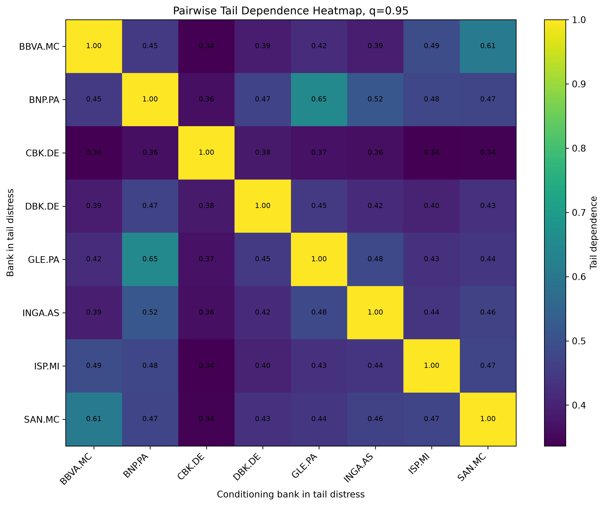

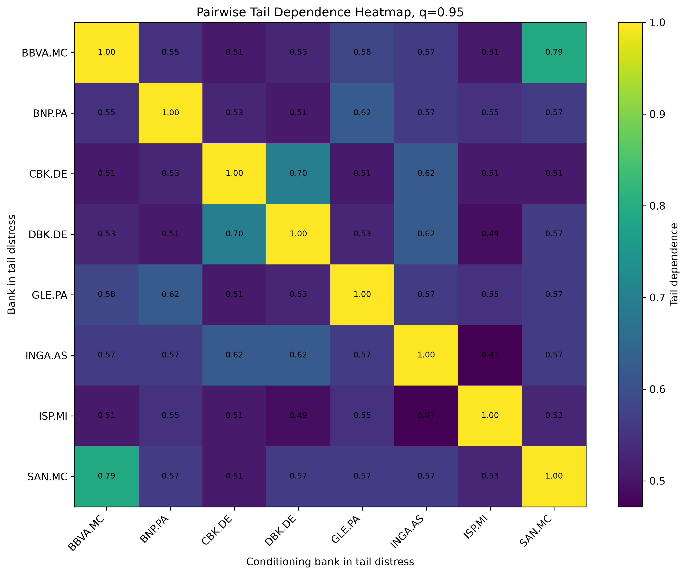

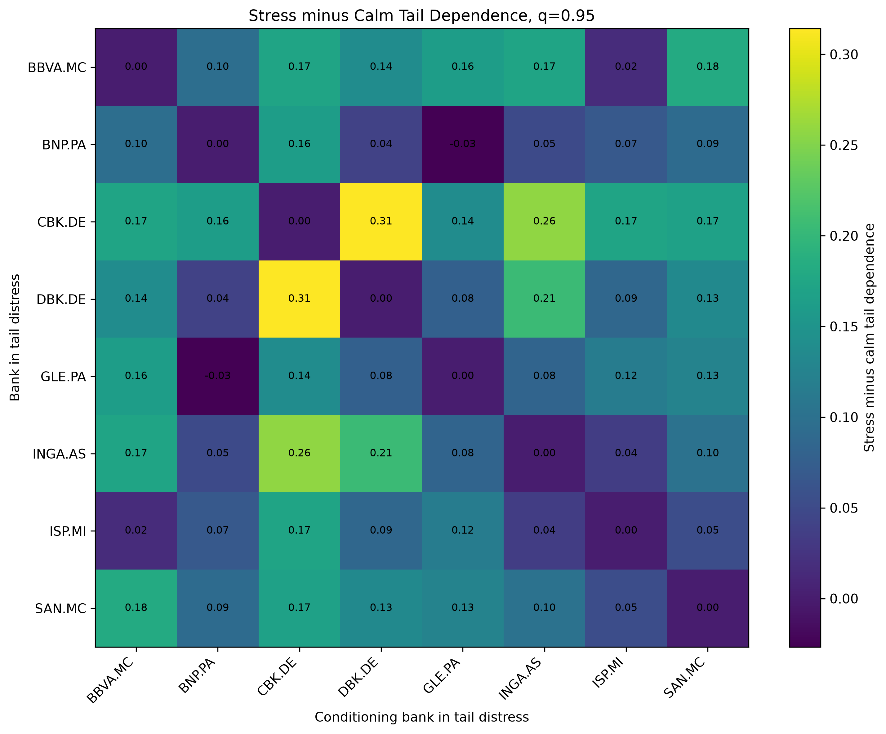

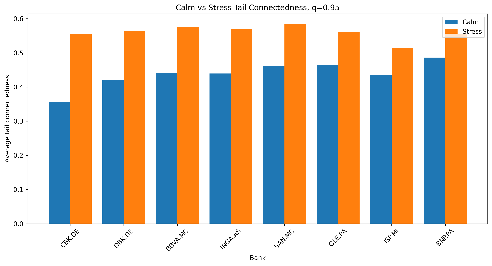
```

### Student-t copula benchmark

```markdown
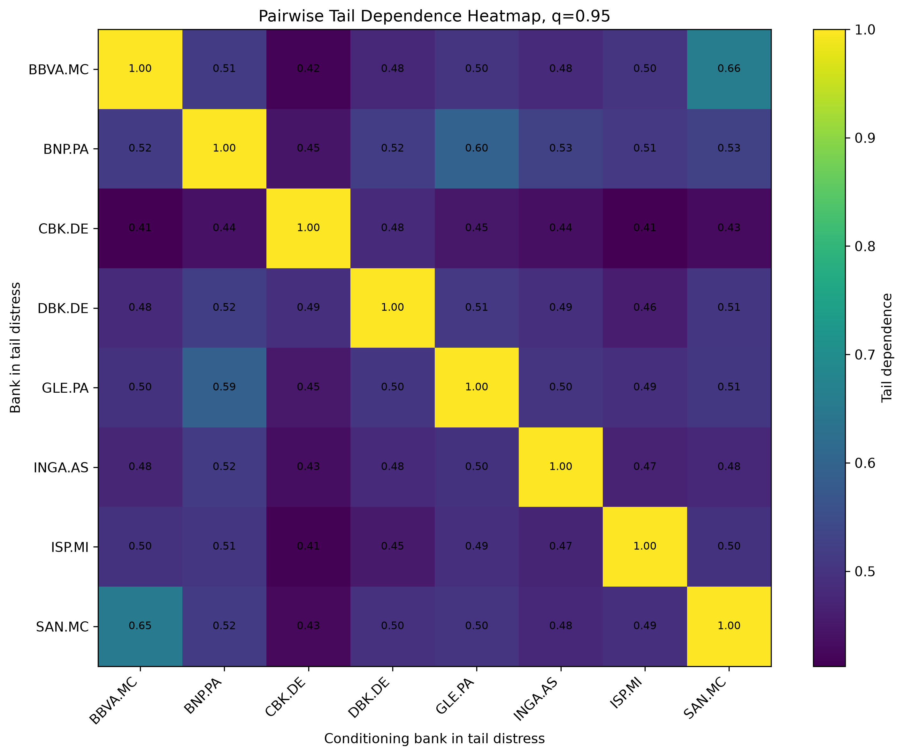

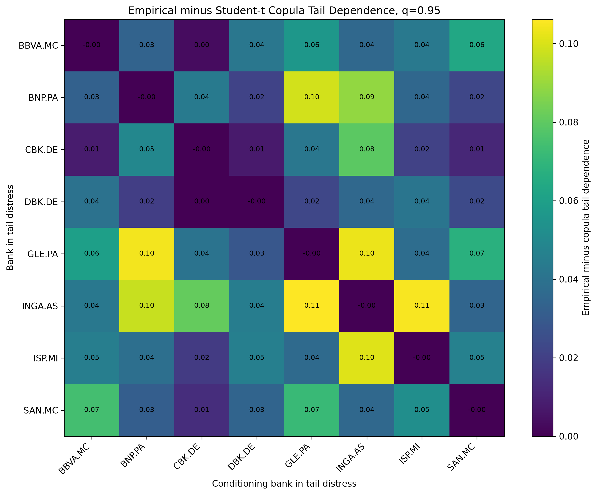

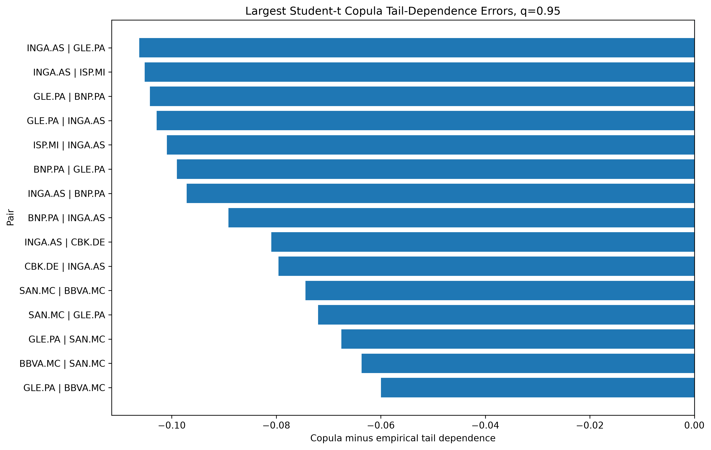
```

### Stress Activation Index

```markdown
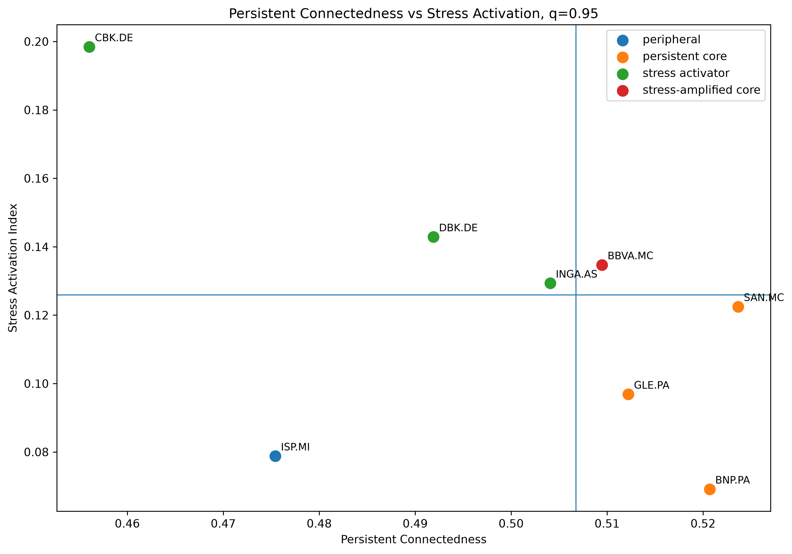

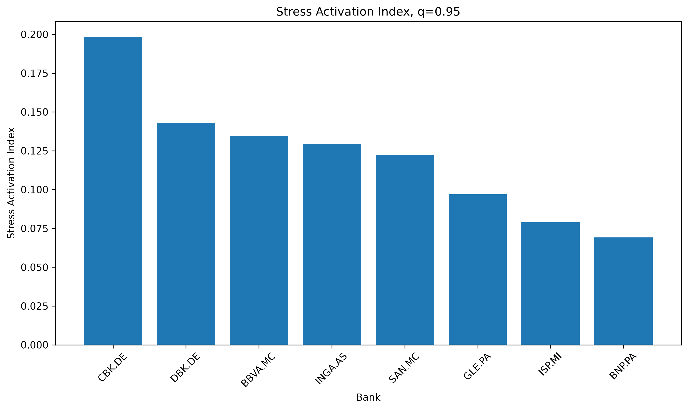

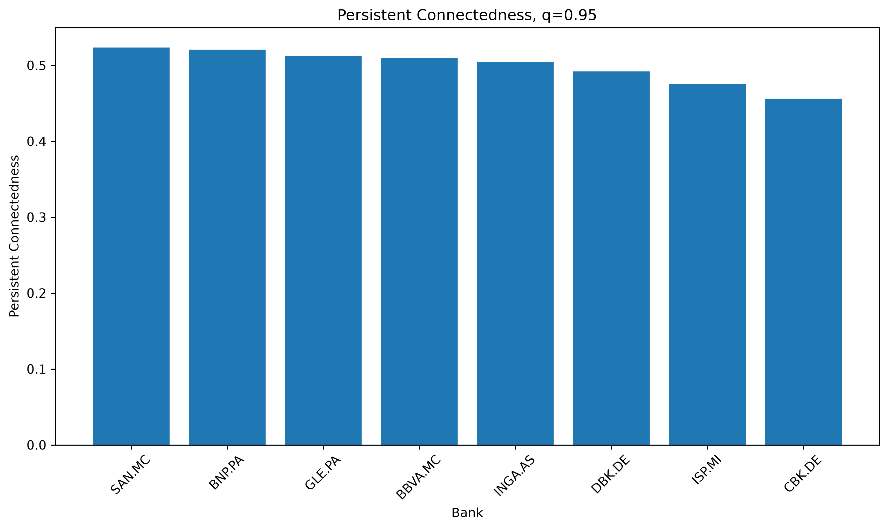

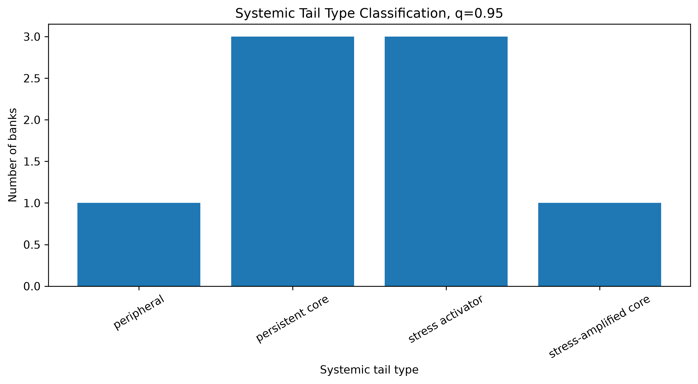
```

---

## Interpretation of key figures

This section gives a short reading guide for the main figures. The figures are meant to be interpreted together rather than independently. The regime-specific heatmaps show how tail dependence changes across market states. The copula plots show what a static parametric benchmark captures or misses. The Stress Activation scatter translates the regime comparison into a bank-level classification.

### `tail_dependence_heatmap_calm_q95.png`

Shows empirical pairwise tail dependence during calm regimes at `q = 0.95`.

Rows represent the bank becoming extreme. Columns represent the conditioning bank already in tail distress.

### `tail_dependence_heatmap_stress_q95.png`

Shows empirical pairwise tail dependence during stress regimes at `q = 0.95`.

Compared with the calm-regime heatmap, tail dependence is stronger and more widespread.

### `tail_dependence_stress_minus_calm_q95.png`

Shows the change in pairwise tail dependence from calm to stress regimes.

Positive values indicate links that strengthen during stress.

The largest prototype increase is the `CBK.DE - DBK.DE` link.

### `student_t_copula_tail_dependence_heatmap_q95.png`

Shows finite-threshold tail dependence generated by the fitted static Student-t copula.

The copula captures broad heavy-tailed dependence but smooths over some strong empirical co-tail links.

### `empirical_minus_student_t_copula_tail_dependence_q95.png`

Shows empirical tail dependence minus Student-t copula tail dependence.

Positive values indicate empirical links stronger than the static copula benchmark.

### `stress_activation_scatter_q95.png`

Plots Persistent Connectedness against the Stress Activation Index.

The median lines separate banks into four systemic-tail types:

- persistent core
- stress activator
- stress-amplified core
- peripheral

This is the central figure for the Stress Activation Index contribution.

---

## Reproducibility notes

All model outputs are generated by scripts in `scripts/`. Scripts are numbered in the intended execution order. Intermediate outputs are written to `data/processed/`, while publication-ready tables and figures are written to `outputs/`.

The repository separates:

- raw data
- processed data
- model outputs
- tables
- figures
- configuration files
- source code

This separation is intentional. Raw data should not be manually edited after download. Processed data should be reproducible from the scripts. Tables and figures should be reproducible from processed outputs. Configuration files should contain modeling choices that may need to be changed when the data source changes.

The `assumptions.md` file records modeling choices, data-quality notes, and interpretation caveats. This file is part of the research record. It should be updated whenever a modeling decision is changed, a data-quality issue is found, or a result is reinterpreted.

---


## Summary of the empirical logic

The empirical logic of the repository is as follows.

First, bank returns are filtered with GJR-GARCH models so that EVT is applied to residual shocks rather than directly to volatility-clustered raw returns. Second, EVT estimates marginal extreme-loss risk and produces conditional VaR and ES forecasts. Third, the sample is split into calm and stress regimes to test whether tail risk differs across market states. Fourth, empirical tail-dependence matrices test whether banks become jointly extreme more often in stress regimes. Fifth, a Student-t copula provides a static parametric benchmark for heavy-tailed dependence. Sixth, the Stress Activation Index converts the regime-specific connectedness evidence into a bank-level classification.

The main substantive interpretation is that systemic relevance is not one-dimensional. Some banks are persistently connected to the system, while others become much more connected during stress. A static ranking can miss this distinction.

---

## Limitations

The current results should be interpreted with the following limitations.

1. The current implementation uses Yahoo/FRED free data.
2. Final empirical estimates should be recomputed using Refinitiv/LSEG data.
3. `UCG.MI` is excluded from the current modeling universe because of Yahoo adjusted-price artifacts.
4. Stress regimes are defined using VIX rather than a euro-area volatility index in the current prototype.
5. Empirical tail-dependence estimates are descriptive and do not imply causal contagion.
6. The Student-t copula is a static benchmark and does not capture regime-specific dependence unless extended.
7. The Stress Activation Index is a descriptive classification device, not a structural causal model.
8. Backtesting results are based on the current prototype sample and should be revisited after the data migration.

---

## Planned Refinitiv/LSEG migration

The final data layer should replace Yahoo/FRED inputs with Refinitiv/LSEG data.

Preferred fields include:

| Data | Preferred field |
|---|---|
| Bank equity prices | Total return index or adjusted close |
| Market index | Euro Stoxx Banks or Euro Stoxx 50 |
| Stress proxy | VSTOXX preferred; VIX fallback |
| Optional bank size controls | Market capitalization, total assets, or book equity |

After the migration, the following should be rerun:

1. data cleaning
2. return construction
3. extreme-return audit
4. GARCH filtering
5. EVT estimation
6. regime-specific EVT
7. tail-dependence networks
8. Student-t copula benchmark
9. Stress Activation Index

The inclusion of `UCG.MI` should be reconsidered after validating Refinitiv price continuity.

---

## Requirements

Core Python packages include:

- pandas
- numpy
- scipy
- matplotlib
- yfinance
- pandas-datareader
- arch
- pyarrow
- pyyaml
- networkx
- jinja2

Install them with:

```bash
pip install -r requirements.txt
```

---

## Project outputs summary

The main final outputs are:

1. cleaned return and loss panels
2. GJR-GARCH standardized residual losses
3. EVT residual VaR and ES estimates
4. conditional VaR and ES forecasts
5. VaR backtesting and ES scoring tables
6. baseline versus regime-specific model comparison
7. empirical tail-dependence matrices
8. regime-specific tail-dependence networks
9. empirical CoVaR-style systemic-risk estimates
10. Student-t copula benchmark comparison
11. Stress Activation Index classification

---

## Citation

If using this repository, cite it as:

```text
Alessandra, L. Extreme Tail Risk and Systemic Connectedness in European Banks. GitHub repository.
```

---

## License

Add a license before public release.

Recommended options:

- MIT License for open code reuse
- Apache 2.0 for a more explicit patent grant
- no license if reuse is not permitted

Without a license, others do not have explicit permission to reuse the code.
